# [📈 Live Status](https://RKTowse.github.io/upptime): <!--live status--> **🟧 Partial outage**

This repository contains the open-source uptime monitor and status page for [RKTowse](https://RKTowse.github.io/upptime), powered by [Upptime](https://github.com/upptime/upptime).

With [Upptime](https://upptime.js.org), you can get your own unlimited and free uptime monitor and status page, powered entirely by a GitHub repository. We use [Issues](https://github.com/RKTowse/upptime/issues) as incident reports, [Actions](https://github.com/RKTowse/upptime/actions) as uptime monitors, and [Pages](https://RKTowse.github.io/upptime) for the status page.

<!--start: status pages-->
<!-- This summary is generated by Upptime (https://github.com/upptime/upptime) -->
<!-- Do not edit this manually, your changes will be overwritten -->
<!-- prettier-ignore -->
| URL | Status | History | Response Time | Uptime |
| --- | ------ | ------- | ------------- | ------ |
|  [Test Broken Site](https://thissitedoesnotexist.koj.co) | 🟥 Down | [test-broken-site.yml](https://github.com/RKTowse/upptime/commits/HEAD/history/test-broken-site.yml) | 

 0ms
     
 | 

<a href="https://RKTowse.github.io/upptime/history/test-broken-site">100.00%</a>
    

|  [OFI](https://www.ofi.ca) | 🟩 Up | [ofi.yml](https://github.com/RKTowse/upptime/commits/HEAD/history/ofi.yml) | 

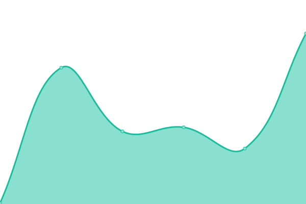 178ms
     
 | 

<a href="https://RKTowse.github.io/upptime/history/ofi">100.00%</a>
    

|  [CEOTR](https://ceotr.ocean.dal.ca) | 🟩 Up | [ceotr.yml](https://github.com/RKTowse/upptime/commits/HEAD/history/ceotr.yml) | 

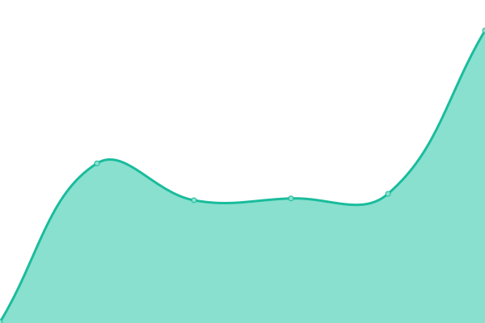 253ms
     
 | 

<a href="https://RKTowse.github.io/upptime/history/ceotr">75.37%</a>
    

|  [Rundeck](https://rundeck.ceotr.ca/menu/home) | 🟩 Up | [rundeck.yml](https://github.com/RKTowse/upptime/commits/HEAD/history/rundeck.yml) | 

 364ms
     
 | 

<a href="https://RKTowse.github.io/upptime/history/rundeck">66.18%</a>
    

|  [Ocean Gliders Canada home](https://dev.oceangliderscanada.ca/) | 🟥 Down | [ocean-gliders-canada-home.yml](https://github.com/RKTowse/upptime/commits/HEAD/history/ocean-gliders-canada-home.yml) | 

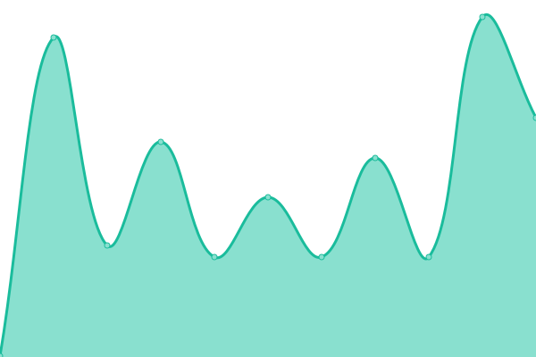 229ms
     
 | 

<a href="https://RKTowse.github.io/upptime/history/ocean-gliders-canada-home">50.07%</a>
    

|  [CEOTR Dev home](https://dev.ceotr.ca/) | 🟥 Down | [ceotr-dev-home.yml](https://github.com/RKTowse/upptime/commits/HEAD/history/ceotr-dev-home.yml) | 

 196ms
     
 | 

<a href="https://RKTowse.github.io/upptime/history/ceotr-dev-home">50.08%</a>
    

|  [conda_channel](https://dev.ceotr.ca/condapkg/) | 🟩 Up | [conda-channel.yml](https://github.com/RKTowse/upptime/commits/HEAD/history/conda-channel.yml) | 

 52ms
     
 | 

<a href="https://RKTowse.github.io/upptime/history/conda-channel">50.21%</a>
    

|  [Sensor tracker Log In](https://dev.ceotr.ca/sensor_tracker/) | 🟥 Down | [sensor-tracker-log-in.yml](https://github.com/RKTowse/upptime/commits/HEAD/history/sensor-tracker-log-in.yml) | 

 150ms
     
 | 

<a href="https://RKTowse.github.io/upptime/history/sensor-tracker-log-in">50.09%</a>
    

|  [CEOTR Dev Ceotr Home](https://dev.ceotr.ca/ceotr_home/) | 🟥 Down | [ceotr-dev-ceotr-home.yml](https://github.com/RKTowse/upptime/commits/HEAD/history/ceotr-dev-ceotr-home.yml) | 

 59ms
     
 | 

<a href="https://RKTowse.github.io/upptime/history/ceotr-dev-ceotr-home">50.09%</a>
    

|  [CEOTR Home Codar](https://dev.ceotr.ca/codar) | 🟥 Down | [ceotr-home-codar.yml](https://github.com/RKTowse/upptime/commits/HEAD/history/ceotr-home-codar.yml) | 

 58ms
     
 | 

<a href="https://RKTowse.github.io/upptime/history/ceotr-home-codar">50.10%</a>
    

|  [CEOTR Home site loads from stylegude](https://dev.ceotr.ca/styleguide) | 🟥 Down | [ceotr-home-site-loads-from-stylegude.yml](https://github.com/RKTowse/upptime/commits/HEAD/history/ceotr-home-site-loads-from-stylegude.yml) | 

 59ms
     
 | 

<a href="https://RKTowse.github.io/upptime/history/ceotr-home-site-loads-from-stylegude">50.10%</a>
    

|  [CEOTR Home site loads](https://ceotrdev.ocean.dal.ca/) | 🟥 Down | [ceotr-home-site-loads.yml](https://github.com/RKTowse/upptime/commits/HEAD/history/ceotr-home-site-loads.yml) | 

 236ms
     
 | 

<a href="https://RKTowse.github.io/upptime/history/ceotr-home-site-loads">50.11%</a>
    

|  [CEOTR Home site loads from condapkg](https://ceotrdev.ocean.dal.ca/condapkg) | 🟥 Down | [ceotr-home-site-loads-from-condapkg.yml](https://github.com/RKTowse/upptime/commits/HEAD/history/ceotr-home-site-loads-from-condapkg.yml) | 

 60ms
     
 | 

<a href="https://RKTowse.github.io/upptime/history/ceotr-home-site-loads-from-condapkg">50.11%</a>
    

|  [Log In site loads from sensor_tracker](https://ceotrdev.ocean.dal.ca/sensor_tracker) | 🟥 Down | [log-in-site-loads-from-sensor-tracker.yml](https://github.com/RKTowse/upptime/commits/HEAD/history/log-in-site-loads-from-sensor-tracker.yml) | 

 137ms
     
 | 

<a href="https://RKTowse.github.io/upptime/history/log-in-site-loads-from-sensor-tracker">50.12%</a>
    

|  [CEOTR Home site loads from ceotr_home](https://ceotrdev.ocean.dal.ca/ceotr_home) | 🟥 Down | [ceotr-home-site-loads-from-ceotr-home.yml](https://github.com/RKTowse/upptime/commits/HEAD/history/ceotr-home-site-loads-from-ceotr-home.yml) | 

 60ms
     
 | 

<a href="https://RKTowse.github.io/upptime/history/ceotr-home-site-loads-from-ceotr-home">50.12%</a>
    

|  [CEOTR Home site loads from codar](https://ceotrdev.ocean.dal.ca/codar) | 🟥 Down | [ceotr-home-site-loads-from-codar.yml](https://github.com/RKTowse/upptime/commits/HEAD/history/ceotr-home-site-loads-from-codar.yml) | 

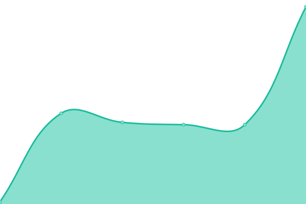 60ms
     
 | 

<a href="https://RKTowse.github.io/upptime/history/ceotr-home-site-loads-from-codar">50.13%</a>
    

|  [CEOTR Home site loads from styleguide](https://ceotrdev.ocean.dal.ca/styleguide) | 🟥 Down | [ceotr-home-site-loads-from-styleguide.yml](https://github.com/RKTowse/upptime/commits/HEAD/history/ceotr-home-site-loads-from-styleguide.yml) | 

 60ms
     
 | 

<a href="https://RKTowse.github.io/upptime/history/ceotr-home-site-loads-from-styleguide">50.13%</a>
    

|  [OGEN Home](https://dev.oceangraduate.com) | 🟩 Up | [ogen-home.yml](https://github.com/RKTowse/upptime/commits/HEAD/history/ogen-home.yml) | 

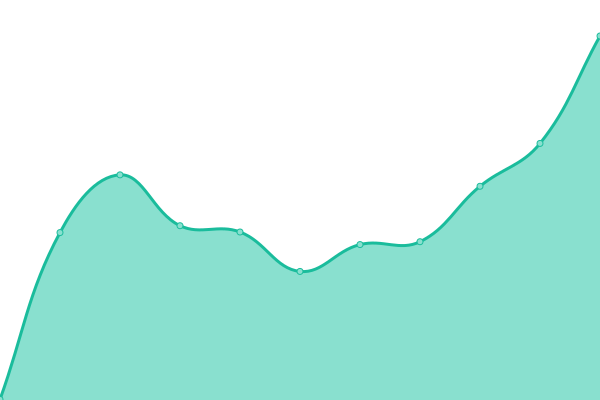 1054ms
     
 | 

<a href="https://RKTowse.github.io/upptime/history/ogen-home">50.28%</a>
    

|  [OGEN Log In](https://dev.oceangraduate.com/wp-login.php) | 🟩 Up | [ogen-log-in.yml](https://github.com/RKTowse/upptime/commits/HEAD/history/ogen-log-in.yml) | 

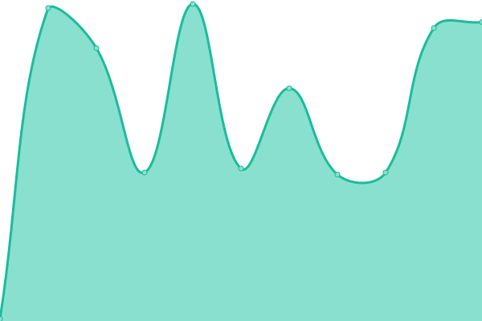 157ms
     
 | 

<a href="https://RKTowse.github.io/upptime/history/ogen-log-in">50.29%</a>
    

|  [OGEN Home](https://dev.ogen.ceotr.ca) | 🟩 Up | [ogen-home.yml](https://github.com/RKTowse/upptime/commits/HEAD/history/ogen-home.yml) | 

 1054ms
     
 | 

<a href="https://RKTowse.github.io/upptime/history/ogen-home">50.28%</a>
    

|  [OGEN Log In](https://dev.ogen.ceotr.ca/wp-login.php) | 🟩 Up | [ogen-log-in.yml](https://github.com/RKTowse/upptime/commits/HEAD/history/ogen-log-in.yml) | 

 157ms
     
 | 

<a href="https://RKTowse.github.io/upptime/history/ogen-log-in">50.29%</a>
    

|  [IMBeR Data Hub](https://dev.imber.ceotr.ca) | 🟩 Up | [im-be-r-data-hub.yml](https://github.com/RKTowse/upptime/commits/HEAD/history/im-be-r-data-hub.yml) | 

 2061ms
     
 | 

<a href="https://RKTowse.github.io/upptime/history/im-be-r-data-hub">50.30%</a>
    

|  [Ocean Gliders Canada Home](https://dev.oceangliderscanada.ca) | 🟥 Down | [ocean-gliders-canada-home.yml](https://github.com/RKTowse/upptime/commits/HEAD/history/ocean-gliders-canada-home.yml) | 

 229ms
     
 | 

<a href="https://RKTowse.github.io/upptime/history/ocean-gliders-canada-home">50.07%</a>
    

|  [STG Home Page](https://stg.oceangliderscanada.ca) | 🟥 Down | [stg-home-page.yml](https://github.com/RKTowse/upptime/commits/HEAD/history/stg-home-page.yml) | 

 0ms
     
 | 

<a href="https://RKTowse.github.io/upptime/history/stg-home-page">0.00%</a>
    

|  [CEOTR STG Home Page loads](https://ceotrstg.ocean.dal.ca) | 🟥 Down | [ceotr-stg-home-page-loads.yml](https://github.com/RKTowse/upptime/commits/HEAD/history/ceotr-stg-home-page-loads.yml) | 

 0ms
     
 | 

<a href="https://RKTowse.github.io/upptime/history/ceotr-stg-home-page-loads">0.00%</a>
    

|  [Bedford Basin Time Series STG](https://ceotrstg.ocean.dal.ca/bbasin) | 🟥 Down | [bedford-basin-time-series-stg.yml](https://github.com/RKTowse/upptime/commits/HEAD/history/bedford-basin-time-series-stg.yml) | 

 0ms
     
 | 

<a href="https://RKTowse.github.io/upptime/history/bedford-basin-time-series-stg">0.00%</a>
    

|  [STG Gliders Page loads from /gliders](https://ceotrstg.ocean.dal.ca/gliders) | 🟥 Down | [stg-gliders-page-loads-from-gliders.yml](https://github.com/RKTowse/upptime/commits/HEAD/history/stg-gliders-page-loads-from-gliders.yml) | 

 0ms
     
 | 

<a href="https://RKTowse.github.io/upptime/history/stg-gliders-page-loads-from-gliders">0.00%</a>
    

|  [STG Sensor Tracker login](https://ceotrstg.ocean.dal.ca/sensor_tracker) | 🟥 Down | [stg-sensor-tracker-login.yml](https://github.com/RKTowse/upptime/commits/HEAD/history/stg-sensor-tracker-login.yml) | 

 0ms
     
 | 

<a href="https://RKTowse.github.io/upptime/history/stg-sensor-tracker-login">0.00%</a>
    

|  [CEOTR Home Page loads](https://stg.ceotr.ca CEOTR Home) | 🟩 Up | [ceotr-home-page-loads.yml](https://github.com/RKTowse/upptime/commits/HEAD/history/ceotr-home-page-loads.yml) | 

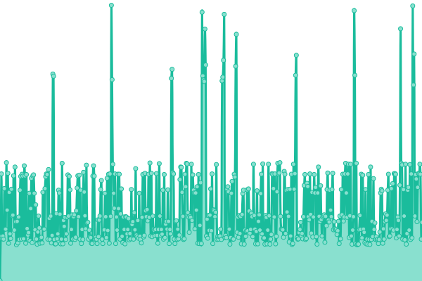 243ms
     
 | 

<a href="https://RKTowse.github.io/upptime/history/ceotr-home-page-loads">98.58%</a>
    

|  [stg Bedford Basin Time Series](https://stg.ceotr.ca/bbasin) | 🟥 Down | [stg-bedford-basin-time-series.yml](https://github.com/RKTowse/upptime/commits/HEAD/history/stg-bedford-basin-time-series.yml) | 

 0ms
     
 | 

<a href="https://RKTowse.github.io/upptime/history/stg-bedford-basin-time-series">0.00%</a>
    

|  [STG Gliders Page](https://stg.ceotr.ca/gliders) | 🟥 Down | [stg-gliders-page.yml](https://github.com/RKTowse/upptime/commits/HEAD/history/stg-gliders-page.yml) | 

 0ms
     
 | 

<a href="https://RKTowse.github.io/upptime/history/stg-gliders-page">0.00%</a>
    

|  [Sensor Tracker login](https://stg.ceotr.ca/sensor_tracker) | 🟩 Up | [sensor-tracker-login.yml](https://github.com/RKTowse/upptime/commits/HEAD/history/sensor-tracker-login.yml) | 

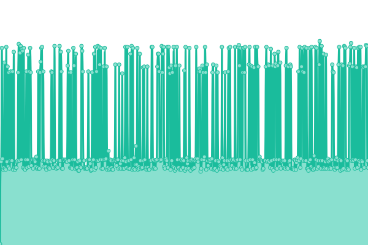 144ms
     
 | 

<a href="https://RKTowse.github.io/upptime/history/sensor-tracker-login">96.78%</a>
    

|  [STG Sensor Tracker Home Page loads](https://stg.nfsi.ceotr.ca) | 🟥 Down | [stg-sensor-tracker-home-page-loads.yml](https://github.com/RKTowse/upptime/commits/HEAD/history/stg-sensor-tracker-home-page-loads.yml) | 

 0ms
     
 | 

<a href="https://RKTowse.github.io/upptime/history/stg-sensor-tracker-home-page-loads">0.00%</a>
    

|  [Ocean Gliders Canada  Home Page loads](https://www.oceangliderscanada.ca) | 🟩 Up | [ocean-gliders-canada-home-page-loads.yml](https://github.com/RKTowse/upptime/commits/HEAD/history/ocean-gliders-canada-home-page-loads.yml) | 

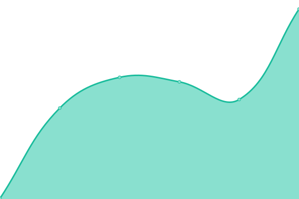 251ms
     
 | 

<a href="https://RKTowse.github.io/upptime/history/ocean-gliders-canada-home-page-loads">75.57%</a>
    

|  [Prod Ocean Gliders Canada  Home Page loads](https://prod.oceangliderscanada.ca) | 🟩 Up | [prod-ocean-gliders-canada-home-page-loads.yml](https://github.com/RKTowse/upptime/commits/HEAD/history/prod-ocean-gliders-canada-home-page-loads.yml) | 

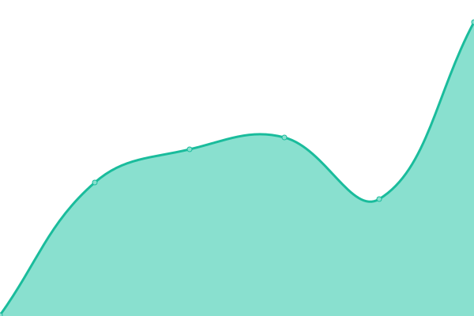 244ms
     
 | 

<a href="https://RKTowse.github.io/upptime/history/prod-ocean-gliders-canada-home-page-loads">75.58%</a>
    

|  [The Ocean Graduate Excellence Network Home](https://prod.oceangraduate.com) | 🟩 Up | [the-ocean-graduate-excellence-network-home.yml](https://github.com/RKTowse/upptime/commits/HEAD/history/the-ocean-graduate-excellence-network-home.yml) | 

 1745ms
     
 | 

<a href="https://RKTowse.github.io/upptime/history/the-ocean-graduate-excellence-network-home">75.58%</a>
    

|  [The Ocean Graduate Excellence Network Home](https://oceangraduate.com) | 🟩 Up | [the-ocean-graduate-excellence-network-home.yml](https://github.com/RKTowse/upptime/commits/HEAD/history/the-ocean-graduate-excellence-network-home.yml) | 

 1745ms
     
 | 

<a href="https://RKTowse.github.io/upptime/history/the-ocean-graduate-excellence-network-home">75.58%</a>
    

|  [The OGEN Home Page loads](https://ogen.ceotr.ca) | 🟩 Up | [the-ogen-home-page-loads.yml](https://github.com/RKTowse/upptime/commits/HEAD/history/the-ogen-home-page-loads.yml) | 

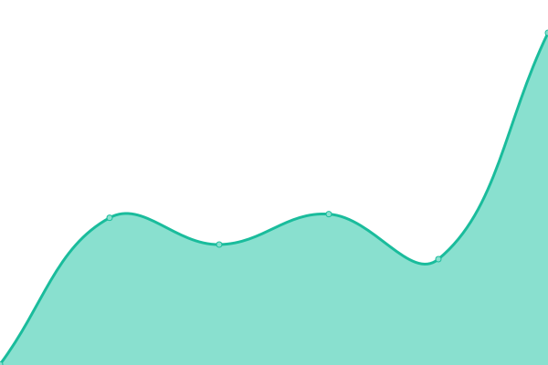 256ms
     
 | 

<a href="https://RKTowse.github.io/upptime/history/the-ogen-home-page-loads">75.59%</a>
    

|  [CEOTR Prod Home Page loads](https://prod.ceotr.ca) | 🟩 Up | [ceotr-prod-home-page-loads.yml](https://github.com/RKTowse/upptime/commits/HEAD/history/ceotr-prod-home-page-loads.yml) | 

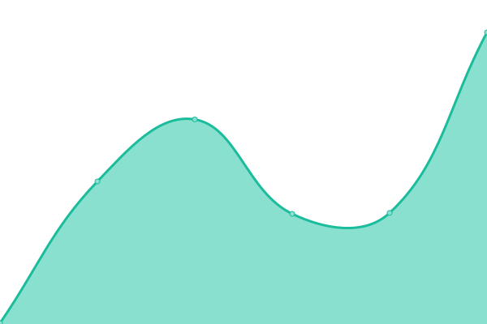 177ms
     
 | 

<a href="https://RKTowse.github.io/upptime/history/ceotr-prod-home-page-loads">75.59%</a>
    

|  [Prod Sensor tracker login](https://prod.ceotr.ca/sensor_tracker) | 🟩 Up | [prod-sensor-tracker-login.yml](https://github.com/RKTowse/upptime/commits/HEAD/history/prod-sensor-tracker-login.yml) | 

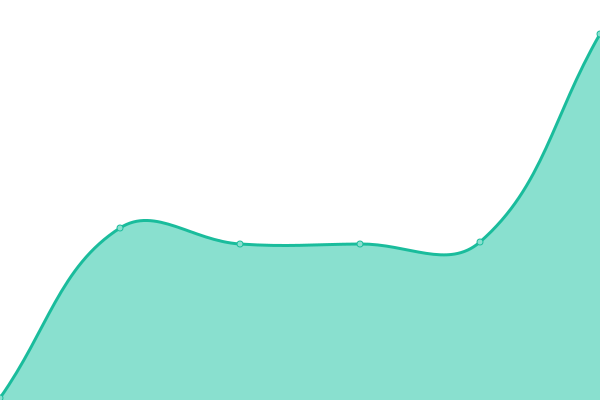 122ms
     
 | 

<a href="https://RKTowse.github.io/upptime/history/prod-sensor-tracker-login">75.64%</a>
    

|  [Prod Maintenance Page](https://prod.ceotr.ca/maintenance) | 🟩 Up | [prod-maintenance-page.yml](https://github.com/RKTowse/upptime/commits/HEAD/history/prod-maintenance-page.yml) | 

 104ms
     
 | 

<a href="https://RKTowse.github.io/upptime/history/prod-maintenance-page">75.65%</a>
    

|  [Prod Gliders Home](https://prod.ceotr.ca/gliders) | 🟩 Up | [prod-gliders-home.yml](https://github.com/RKTowse/upptime/commits/HEAD/history/prod-gliders-home.yml) | 

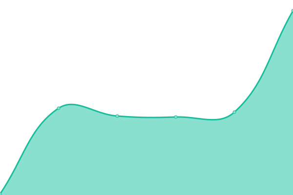 119ms
     
 | 

<a href="https://RKTowse.github.io/upptime/history/prod-gliders-home">75.65%</a>
    

|  [Prod Bedford Basin Times Series Home](https://prod.ceotr.ca/bbasin) | 🟩 Up | [prod-bedford-basin-times-series-home.yml](https://github.com/RKTowse/upptime/commits/HEAD/history/prod-bedford-basin-times-series-home.yml) | 

 55ms
     
 | 

<a href="https://RKTowse.github.io/upptime/history/prod-bedford-basin-times-series-home">75.66%</a>
    

|  [CEOTR ERDDAP Page](https://prod.ceotr.ca/erddap) | 🟩 Up | [ceotr-erddap-page.yml](https://github.com/RKTowse/upptime/commits/HEAD/history/ceotr-erddap-page.yml) | 

 362ms
     
 | 

<a href="https://RKTowse.github.io/upptime/history/ceotr-erddap-page">75.66%</a>
    

|  [CEOTR Home Page](https://www.ceotr.ca) | 🟩 Up | [ceotr-home-page.yml](https://github.com/RKTowse/upptime/commits/HEAD/history/ceotr-home-page.yml) | 

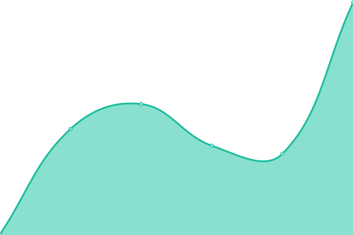 190ms
     
 | 

<a href="https://RKTowse.github.io/upptime/history/ceotr-home-page">75.66%</a>
    

|  [Sensor tracker login](https://www.ceotr.ca/sensor_tracker) | 🟩 Up | [sensor-tracker-login.yml](https://github.com/RKTowse/upptime/commits/HEAD/history/sensor-tracker-login.yml) | 

 144ms
     
 | 

<a href="https://RKTowse.github.io/upptime/history/sensor-tracker-login">96.78%</a>
    

|  [CEOTR Maintenance](https://www.ceotr.ca/maintenance =) | 🟥 Down | [ceotr-maintenance.yml](https://github.com/RKTowse/upptime/commits/HEAD/history/ceotr-maintenance.yml) | 

 0ms
     
 | 

<a href="https://RKTowse.github.io/upptime/history/ceotr-maintenance">0.00%</a>
    

|  [CEOTR Gliders](https://www.ceotr.ca/gliders) | 🟩 Up | [ceotr-gliders.yml](https://github.com/RKTowse/upptime/commits/HEAD/history/ceotr-gliders.yml) | 

 117ms
     
 | 

<a href="https://RKTowse.github.io/upptime/history/ceotr-gliders">75.67%</a>
    

|  [CEOTR Bedford Basin Times Series](https://www.ceotr.ca/bbasin) | 🟩 Up | [ceotr-bedford-basin-times-series.yml](https://github.com/RKTowse/upptime/commits/HEAD/history/ceotr-bedford-basin-times-series.yml) | 

 55ms
     
 | 

<a href="https://RKTowse.github.io/upptime/history/ceotr-bedford-basin-times-series">75.68%</a>
    

|  [CEOTR ERDDAP Page loads](https://www.ceotr.ca/erddap) | 🟩 Up | [ceotr-erddap-page-loads.yml](https://github.com/RKTowse/upptime/commits/HEAD/history/ceotr-erddap-page-loads.yml) | 

 163ms
     
 | 

<a href="https://RKTowse.github.io/upptime/history/ceotr-erddap-page-loads">75.68%</a>
    

|  [CEOTR Home](https://ceotr.ca) | 🟩 Up | [ceotr-home.yml](https://github.com/RKTowse/upptime/commits/HEAD/history/ceotr-home.yml) | 

 183ms
     
 | 

<a href="https://RKTowse.github.io/upptime/history/ceotr-home">75.69%</a>
    

|  [CEOTR OCEAN Maintenance](https://ceotr.ocean.dal.ca/maintenance) | 🟩 Up | [ceotr-ocean-maintenance.yml](https://github.com/RKTowse/upptime/commits/HEAD/history/ceotr-ocean-maintenance.yml) | 

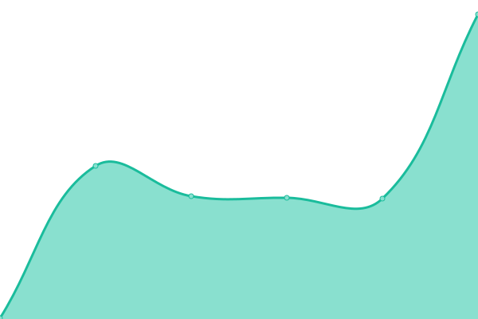 249ms
     
 | 

<a href="https://RKTowse.github.io/upptime/history/ceotr-ocean-maintenance">75.69%</a>
    

|  [CEOTR OCEAN Gliders](https://ceotr.ocean.dal.ca/gliders) | 🟩 Up | [ceotr-ocean-gliders.yml](https://github.com/RKTowse/upptime/commits/HEAD/history/ceotr-ocean-gliders.yml) | 

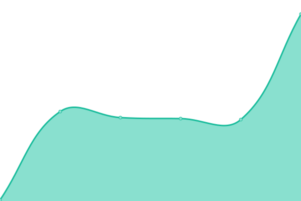 118ms
     
 | 

<a href="https://RKTowse.github.io/upptime/history/ceotr-ocean-gliders">75.69%</a>
    

|  [HTTPS Bedford Basin Times Series Page loads](https://ceotr.ocean.dal.ca/bbasin) | 🟩 Up | [https-bedford-basin-times-series-page-loads.yml](https://github.com/RKTowse/upptime/commits/HEAD/history/https-bedford-basin-times-series-page-loads.yml) | 

 56ms
     
 | 

<a href="https://RKTowse.github.io/upptime/history/https-bedford-basin-times-series-page-loads">75.70%</a>
    

|  [HTTPS ERDDAP Page loads](https://ceotr.ocean.dal.ca/erddap) | 🟩 Up | [https-erddap-page-loads.yml](https://github.com/RKTowse/upptime/commits/HEAD/history/https-erddap-page-loads.yml) | 

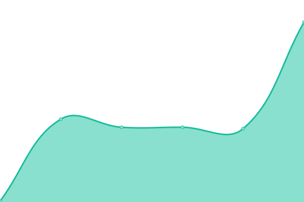 164ms
     
 | 

<a href="https://RKTowse.github.io/upptime/history/https-erddap-page-loads">75.70%</a>
    

|  [HTTPS CEOTR Home Page loads](https://cproof.ocean.dal.ca) | 🟩 Up | [https-ceotr-home-page-loads.yml](https://github.com/RKTowse/upptime/commits/HEAD/history/https-ceotr-home-page-loads.yml) | 

 251ms
     
 | 

<a href="https://RKTowse.github.io/upptime/history/https-ceotr-home-page-loads">77.55%</a>
    

|  [HTTPS Sensor tracker login Page loads](https://cproof.ocean.dal.ca/sensor_tracker) | 🟩 Up | [https-sensor-tracker-login-page-loads.yml](https://github.com/RKTowse/upptime/commits/HEAD/history/https-sensor-tracker-login-page-loads.yml) | 

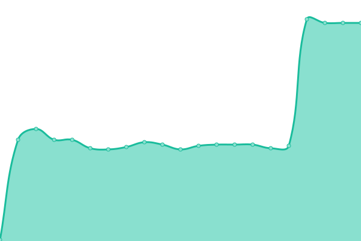 129ms
     
 | 

<a href="https://RKTowse.github.io/upptime/history/https-sensor-tracker-login-page-loads">77.56%</a>
    

|  [CEOTR Home Page loads](https://cproof.ceotr.ca) | 🟩 Up | [ceotr-home-page-loads.yml](https://github.com/RKTowse/upptime/commits/HEAD/history/ceotr-home-page-loads.yml) | 

 243ms
     
 | 

<a href="https://RKTowse.github.io/upptime/history/ceotr-home-page-loads">98.58%</a>
    

|  [HTTPS Sensor tracker login Page loads](https://cproof.ceotr.ca/sensor_tracker) | 🟩 Up | [https-sensor-tracker-login-page-loads.yml](https://github.com/RKTowse/upptime/commits/HEAD/history/https-sensor-tracker-login-page-loads.yml) | 

 129ms
     
 | 

<a href="https://RKTowse.github.io/upptime/history/https-sensor-tracker-login-page-loads">77.56%</a>
    

|  [CEOTR Home Page loads](https://dfocogg.ceotr.ca) | 🟩 Up | [ceotr-home-page-loads.yml](https://github.com/RKTowse/upptime/commits/HEAD/history/ceotr-home-page-loads.yml) | 

 243ms
     
 | 

<a href="https://RKTowse.github.io/upptime/history/ceotr-home-page-loads">98.58%</a>
    

|  [HTTPS Sensor tracker login Page loads](https://dfocogg.ceotr.ca/sensor_tracker) | 🟩 Up | [https-sensor-tracker-login-page-loads.yml](https://github.com/RKTowse/upptime/commits/HEAD/history/https-sensor-tracker-login-page-loads.yml) | 

 129ms
     
 | 

<a href="https://RKTowse.github.io/upptime/history/https-sensor-tracker-login-page-loads">77.56%</a>
    

|  [Test HTTPS CEOTR Home Page loads](https://dfocogg.ocean.dal.ca) | 🟩 Up | [test-https-ceotr-home-page-loads.yml](https://github.com/RKTowse/upptime/commits/HEAD/history/test-https-ceotr-home-page-loads.yml) | 

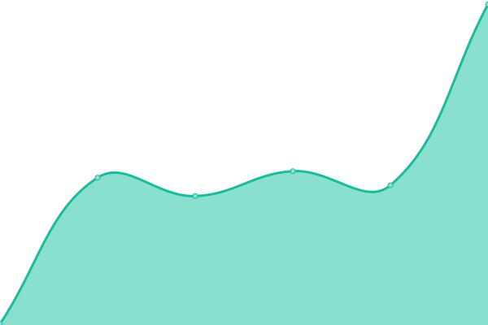 243ms
     
 | 

<a href="https://RKTowse.github.io/upptime/history/test-https-ceotr-home-page-loads">77.58%</a>
    

|  [HTTPS Sensor tracker login Page loads](https://dfocogg.ocean.dal.ca/sensor_tracker) | 🟩 Up | [https-sensor-tracker-login-page-loads.yml](https://github.com/RKTowse/upptime/commits/HEAD/history/https-sensor-tracker-login-page-loads.yml) | 

 129ms
     
 | 

<a href="https://RKTowse.github.io/upptime/history/https-sensor-tracker-login-page-loads">77.56%</a>
    

|  [Home Page loads](https://dfo.oppenav.ceotr.ca) | 🟩 Up | [home-page-loads.yml](https://github.com/RKTowse/upptime/commits/HEAD/history/home-page-loads.yml) | 

 212ms
     
 | 

<a href="https://RKTowse.github.io/upptime/history/home-page-loads">77.45%</a>
    

|  [NFSI Home Page loads](https://nfsi.ceotr.ca) | 🟩 Up | [nfsi-home-page-loads.yml](https://github.com/RKTowse/upptime/commits/HEAD/history/nfsi-home-page-loads.yml) | 

 315ms
     
 | 

<a href="https://RKTowse.github.io/upptime/history/nfsi-home-page-loads">75.72%</a>
    

|  [NFSI Home Page loads](https://www.nfsi.ca) | 🟩 Up | [nfsi-home-page-loads.yml](https://github.com/RKTowse/upptime/commits/HEAD/history/nfsi-home-page-loads.yml) | 

 315ms
     
 | 

<a href="https://RKTowse.github.io/upptime/history/nfsi-home-page-loads">75.72%</a>
    

|  [Data Home Page loads](https://data.ceotr.ca) | 🟥 Down | [data-home-page-loads.yml](https://github.com/RKTowse/upptime/commits/HEAD/history/data-home-page-loads.yml) | 

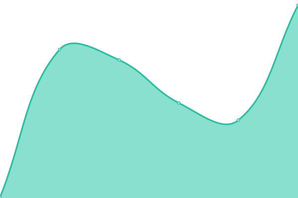 229ms
     
 | 

<a href="https://RKTowse.github.io/upptime/history/data-home-page-loads">0.00%</a>
    

|  [Data Temp Index Page loads](https://data.ceotr.ca/temp) | 🟩 Up | [data-temp-index-page-loads.yml](https://github.com/RKTowse/upptime/commits/HEAD/history/data-temp-index-page-loads.yml) | 

 107ms
     
 | 

<a href="https://RKTowse.github.io/upptime/history/data-temp-index-page-loads">75.78%</a>
    

|  [Data Springbloom Index Page loads](https://data.ceotr.ca/springbloom) | 🟩 Up | [data-springbloom-index-page-loads.yml](https://github.com/RKTowse/upptime/commits/HEAD/history/data-springbloom-index-page-loads.yml) | 

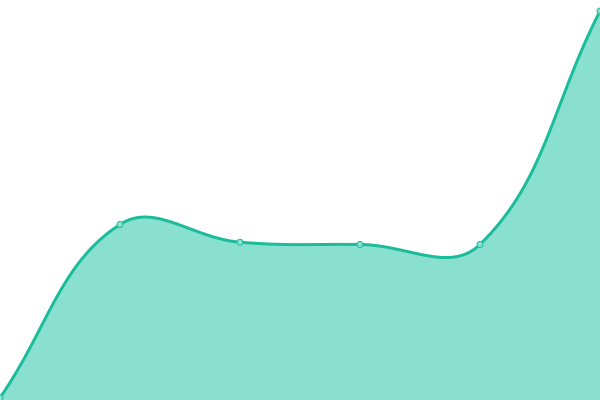 107ms
     
 | 

<a href="https://RKTowse.github.io/upptime/history/data-springbloom-index-page-loads">75.79%</a>
    

|  [CEOTR JIRA](https://ceotr.atlassian.net/jira) | 🟩 Up | [ceotr-jira.yml](https://github.com/RKTowse/upptime/commits/HEAD/history/ceotr-jira.yml) | 

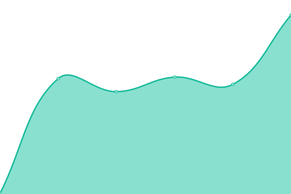 296ms
     
 | 

<a href="https://RKTowse.github.io/upptime/history/ceotr-jira">100.00%</a>
    

|  [CEOTR Confluence](https://confluence.ceotr.ca) | 🟩 Up | [ceotr-confluence.yml](https://github.com/RKTowse/upptime/commits/HEAD/history/ceotr-confluence.yml) | 

 2616ms
     
 | 

<a href="https://RKTowse.github.io/upptime/history/ceotr-confluence">75.79%</a>
    

|  [WIKI oceangliderscanada.ca](https://wiki.oceangliderscanada.ca) | 🟩 Up | [wiki-oceangliderscanada-ca.yml](https://github.com/RKTowse/upptime/commits/HEAD/history/wiki-oceangliderscanada-ca.yml) | 

 311ms
     
 | 

<a href="https://RKTowse.github.io/upptime/history/wiki-oceangliderscanada-ca">75.79%</a>
    

|  [npm. NPM Home Page loads](https://npm.ceotr.ca) | 🟩 Up | [npm-npm-home-page-loads.yml](https://github.com/RKTowse/upptime/commits/HEAD/history/npm-npm-home-page-loads.yml) | 

 231ms
     
 | 

<a href="https://RKTowse.github.io/upptime/history/npm-npm-home-page-loads">75.80%</a>
    

|  [lychee. Albums Page loads](https://lychee.ceotr.ca) | 🟩 Up | [lychee-albums-page-loads.yml](https://github.com/RKTowse/upptime/commits/HEAD/history/lychee-albums-page-loads.yml) | 

 307ms
     
 | 

<a href="https://RKTowse.github.io/upptime/history/lychee-albums-page-loads">75.80%</a>
    

|  [piwigo. CEOTR Gallery Page loads](https://piwigo.ceotr.ca) | 🟩 Up | [piwigo-ceotr-gallery-page-loads.yml](https://github.com/RKTowse/upptime/commits/HEAD/history/piwigo-ceotr-gallery-page-loads.yml) | 

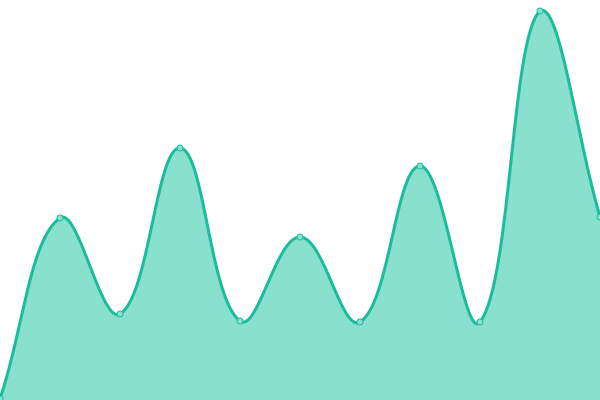 237ms
     
 | 

<a href="https://RKTowse.github.io/upptime/history/piwigo-ceotr-gallery-page-loads">75.81%</a>
    

|  [piwigo. CEOTR Gallery Page loads](https://piwigo.ceotr.ca/piwigo) | 🟩 Up | [piwigo-ceotr-gallery-page-loads.yml](https://github.com/RKTowse/upptime/commits/HEAD/history/piwigo-ceotr-gallery-page-loads.yml) | 

 237ms
     
 | 

<a href="https://RKTowse.github.io/upptime/history/piwigo-ceotr-gallery-page-loads">75.81%</a>
    

|  [Imber Info Home Page loads](https://imber.ceotr.ca) | 🟩 Up | [imber-info-home-page-loads.yml](https://github.com/RKTowse/upptime/commits/HEAD/history/imber-info-home-page-loads.yml) | 

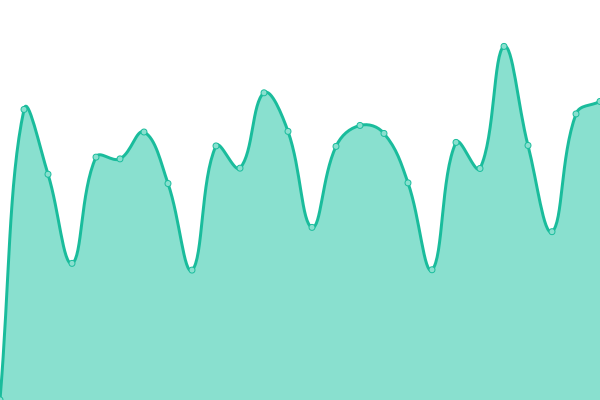 1558ms
     
 | 

<a href="https://RKTowse.github.io/upptime/history/imber-info-home-page-loads">75.81%</a>
    

|  [Imber Info Home Page loads](https://imber.ceotr.ca) | 🟩 Up | [imber-info-home-page-loads.yml](https://github.com/RKTowse/upptime/commits/HEAD/history/imber-info-home-page-loads.yml) | 

 1558ms
     
 | 

<a href="https://RKTowse.github.io/upptime/history/imber-info-home-page-loads">75.81%</a>
    

|  [Imber Info Home Page loads](https://imber.info) | 🟩 Up | [imber-info-home-page-loads.yml](https://github.com/RKTowse/upptime/commits/HEAD/history/imber-info-home-page-loads.yml) | 

 1558ms
     
 | 

<a href="https://RKTowse.github.io/upptime/history/imber-info-home-page-loads">75.81%</a>
    

|  [Imber Info Home Page loads](https://www.imber.info) | 🟩 Up | [imber-info-home-page-loads.yml](https://github.com/RKTowse/upptime/commits/HEAD/history/imber-info-home-page-loads.yml) | 

 1558ms
     
 | 

<a href="https://RKTowse.github.io/upptime/history/imber-info-home-page-loads">75.81%</a>
    

|  [Imber Info Home Page loads](https://imber.ocean.dal.ca) | 🟩 Up | [imber-info-home-page-loads.yml](https://github.com/RKTowse/upptime/commits/HEAD/history/imber-info-home-page-loads.yml) | 

 1558ms
     
 | 

<a href="https://RKTowse.github.io/upptime/history/imber-info-home-page-loads">75.81%</a>
    

|  [Old Imber Info Home Page loads](https://oldimber.ceotr.ca) | 🟩 Up | [old-imber-info-home-page-loads.yml](https://github.com/RKTowse/upptime/commits/HEAD/history/old-imber-info-home-page-loads.yml) | 

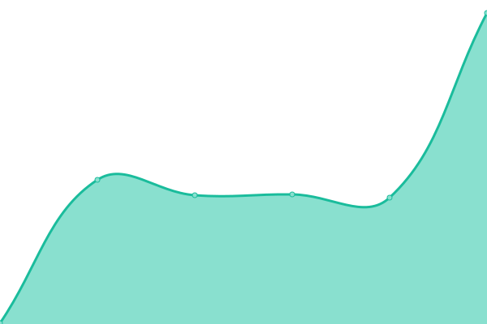 234ms
     
 | 

<a href="https://RKTowse.github.io/upptime/history/old-imber-info-home-page-loads">75.84%</a>
    

<!--end: status pages-->

[**Visit our status website →**](https://RKTowse.github.io/upptime)

## 📄 License

- Powered by: [Upptime](https://github.com/upptime/upptime)
- Code: [MIT](./LICENSE) © [RKTowse](https://RKTowse.github.io/upptime)
- Data in the `./history` directory: [Open Database License](https://opendatacommons.org/licenses/odbl/1-0/)
